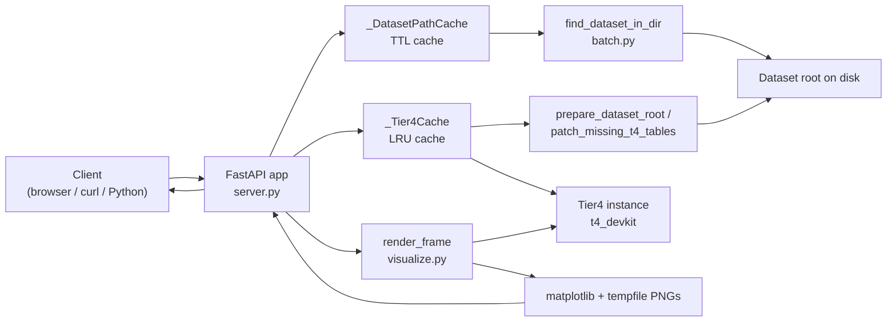
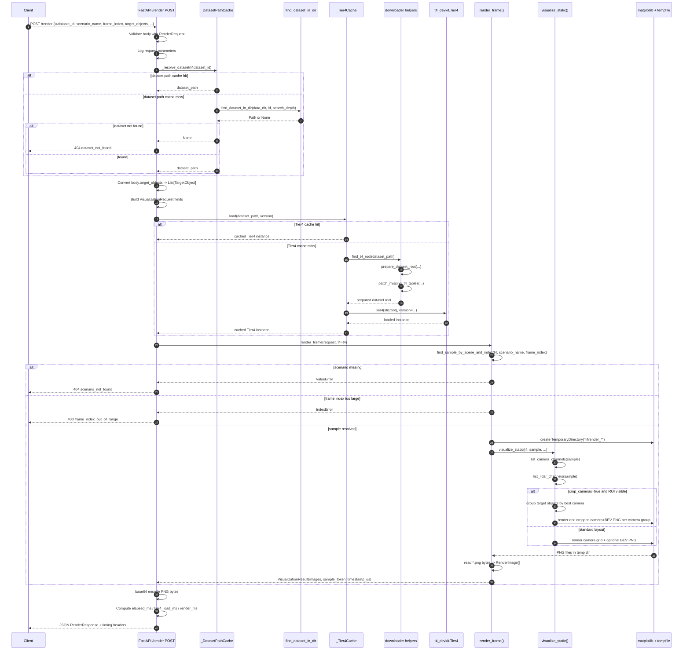
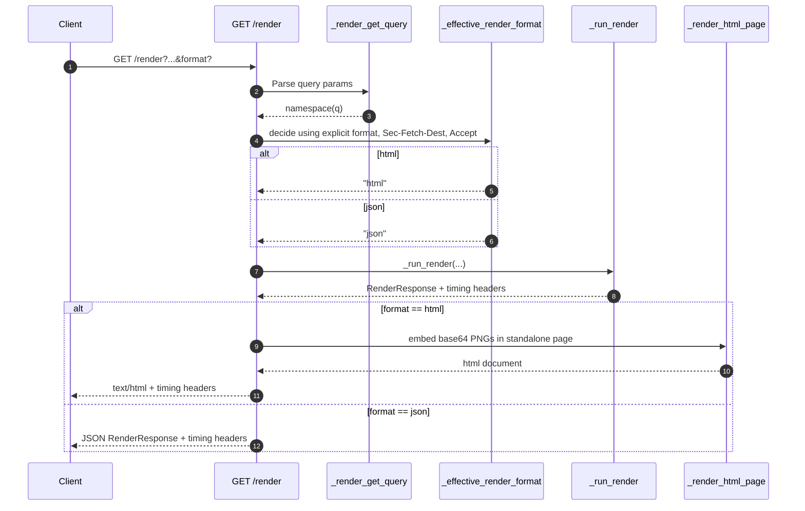
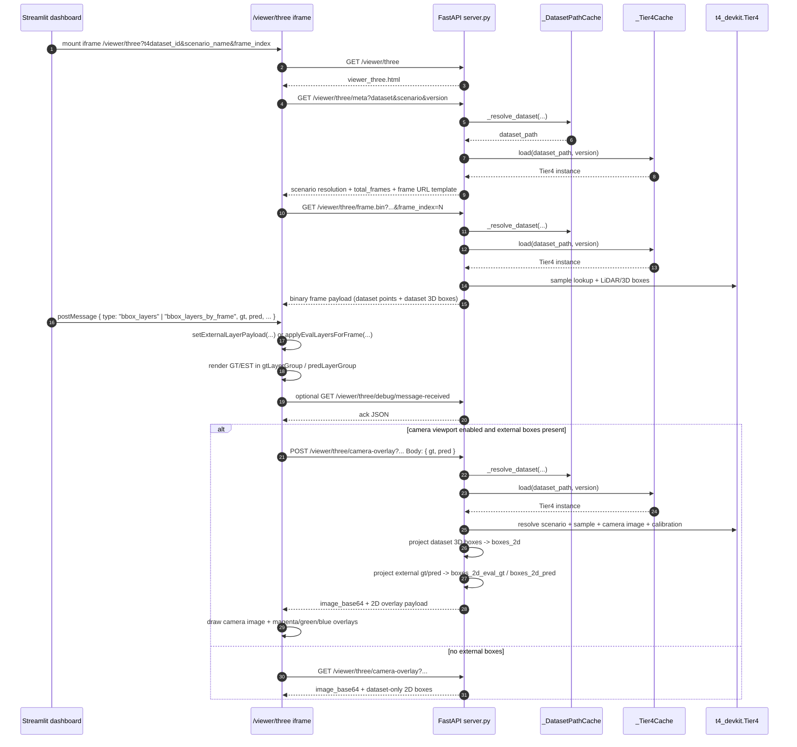
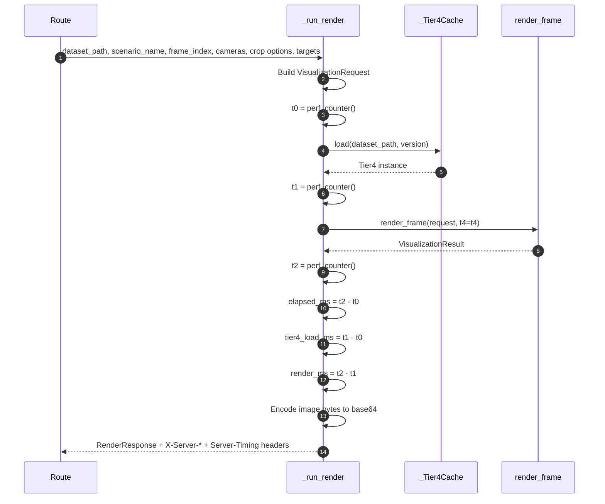
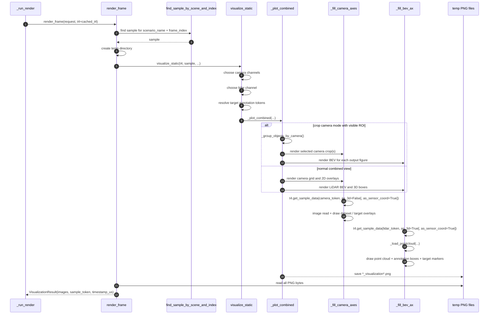
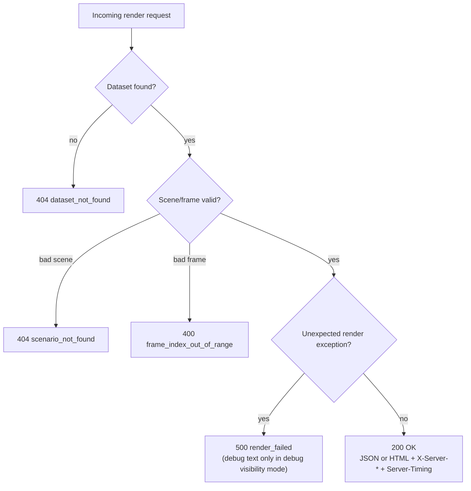

# T4 render server - request sequence and rendering pipeline

This document explains the detailed `/render` request flow implemented in `t4_visualizer/server.py` and `t4_visualizer/visualize.py`. It focuses on how a render request moves through dataset resolution, Tier4 caching, frame lookup, matplotlib rendering, and final JSON or HTML response generation.

**Related code**

- HTTP routes: `t4_visualizer/server.py`
- Render API: `t4_visualizer/visualize.py`
- Dataset discovery: `t4_visualizer/batch.py`
- Dataset preparation helpers: `t4_visualizer/downloader.py`

---

## 1. System context

---

## 2. `POST /render` detailed sequence

This is the most complete path because it supports `target_objects`.

---

## 3. `GET /render` sequence with response-format branching

`GET /render` shares the same render core, but first decides whether the response should be JSON or HTML.

`GET /render/view` and `GET /render/html` skip the content-negotiation step and always take the HTML branch.

Important boundary:

- `/render`, `/render/view`, and `/render/html` return rendered PNG output from `render_frame()`.
- They do not accept external `pred` / `gt` evaluation box payloads from an embedding dashboard.
- When a parent page needs to inject evaluation boxes into an embedded iframe, the relevant path is `/viewer/three`, not `/render/html`.

---

## 4. Embedded iframe flow with external `pred` / `gt` boxes

When the page is embedded inside an evaluation dashboard such as Streamlit and the parent wants to provide prediction / estimate boxes, the flow switches to the Three.js viewer endpoints in `server.py`.

What lives where in this embedded-dashboard mode:

- Dataset LiDAR and dataset 3D annotations come from `/viewer/three/frame.bin`.
- External `pred` / `gt` boxes come from the parent page through `window.postMessage`.
- External boxes are not stored in the dataset and are not packed into `frame.bin`.
- Server-side projection of those external boxes happens only on `POST /viewer/three/camera-overlay`.

If you want the deeper viewer-specific pipeline, see [viewer_3d_pipeline.md](/home/leigu/evaluator_result_parser/docs/viewer_3d_pipeline.md).

---

## 5. `_run_render()` internals

`_run_render()` in `t4_visualizer/server.py` is the central bridge between HTTP and the pure render API.

---

## 6. `render_frame()` internals

The HTTP layer does not draw images itself. The actual rendering lives in `t4_visualizer/visualize.py`.

---

## 7. Error and timing behavior

Timing headers are generated only after a successful render:

- `X-Server-Elapsed-Ms`
- `X-Server-Tier4-Load-Ms`
- `X-Server-Render-Ms`
- `Server-Timing`

---

## 8. Mental model

- `_DatasetPathCache` avoids rescanning the data directory for repeated dataset IDs.
- `_Tier4Cache` avoids reloading `Tier4(...)` for repeated renders against the same dataset path.
- `_run_render()` is the HTTP-to-render adapter.
- `render_frame()` is the pure programmatic rendering entry point.
- `visualize_static()` and `_plot_combined()` do the actual matplotlib drawing.
- `POST /render` adds `target_objects`; `GET /render` is the same core flow but without that body payload.
- Embedded evaluation iframes with external `pred` / `gt` boxes use `/viewer/three` plus `postMessage`, and optionally `POST /viewer/three/camera-overlay` for 2D projection.
