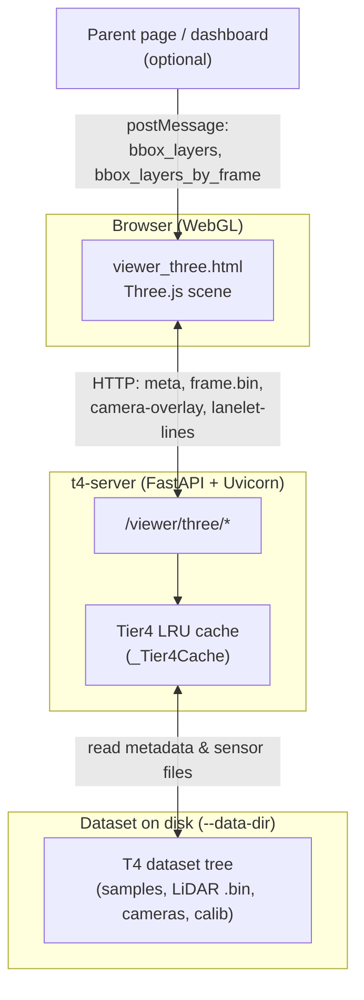
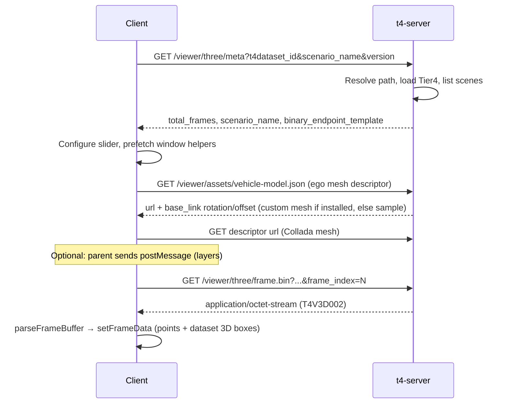
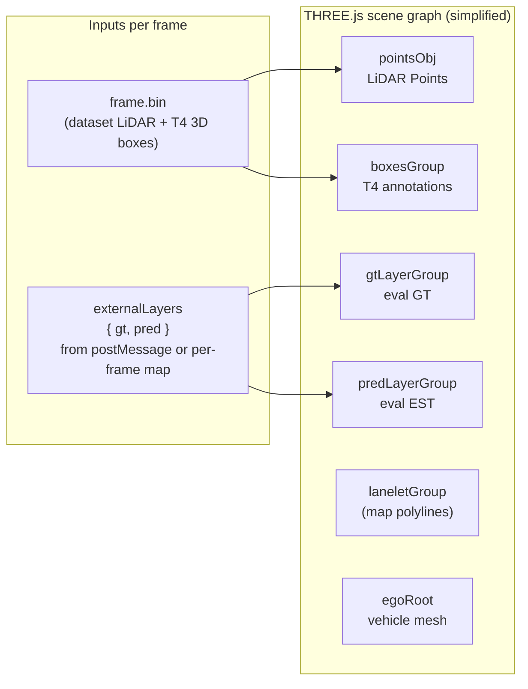
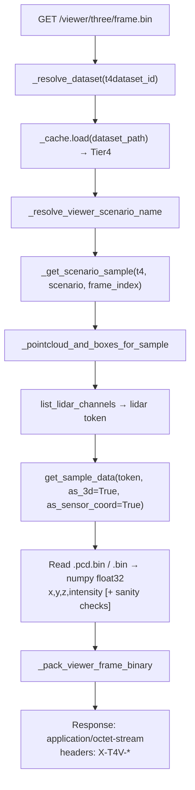
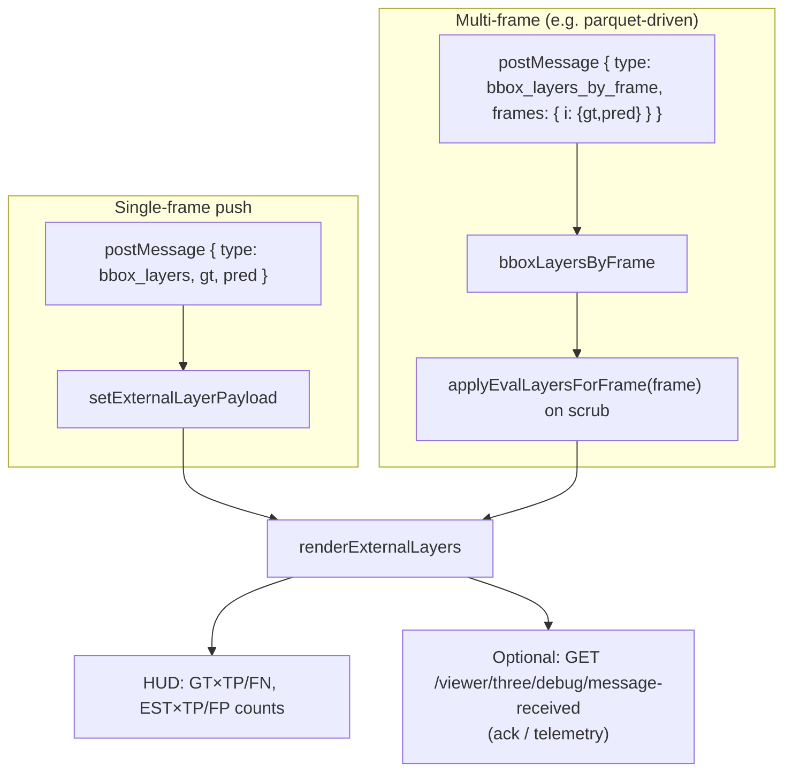
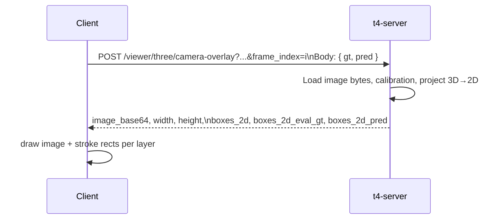

# Three.js 3D viewer — data flow and rendering pipeline

This document describes how the **T4 Three.js viewer** (`/viewer/three`) loads data from `t4-server`, renders LiDAR and 3D boxes in the browser, and optionally overlays **evaluation GT / prediction (EST)** boxes in 3D and on camera images. Use it for onboarding, architecture reviews, and README deep-links.

**Related code**

- Server routes: `t4_visualizer/server.py` (`/viewer/three/*`)
- Client: `t4_visualizer/templates/viewer_three.html`
- Binary frame packer: `_pack_viewer_frame_binary` in `server.py`

---

## 1. System context



The viewer is a **single-page client** that talks to the same origin as `t4-server`. A **parent iframe** can push GT/EST box arrays via `window.postMessage`; those layers are **not** stored in the T4 dataset — they live only in browser memory unless you persist them yourself.

---

## 2. Bootstrap (first paint)

On load, the client reads query parameters (`t4dataset_id`, `scenario_name`, `frame_index`, optional `version`) and fetches metadata. The main 3D canvas is initialized once (scene, lights, grid, ego vehicle mesh, point cloud object, box groups).



**Schema reference:** `GET /viewer/three/schema` documents the binary layout (`T4V3D002`: header + float32 points + 8-corner boxes + JSON labels).

---

## 3. Per-frame update (scrub / play)

When the user changes `frame_index`, the client runs `showFrame(i)`:

1. **`fetchFrame(i)`** — GET `frame.bin` (client-side LRU `Map`, `MAX_CACHE` frames).
2. **`setFrameData`** — uploads LiDAR to `THREE.Points`; rebuilds **dataset** 3D boxes in `boxesGroup` (wireframe from 8 corners for `T4V3D002`).
3. **`applyEvalLayersForFrame`** — if the parent sent **`bbox_layers_by_frame`**, pick `gt` / `pred` arrays for frame `i` and call `setExternalLayerPayload`.
4. **`renderExternalLayers`** — draws **GT** and **EST** into separate groups (`gtLayerGroup`, `predLayerGroup`) using center+size+yaw JSON (see §5).
5. **`prefetchAround`** — requests neighboring frames to warm the cache.
6. **`refreshCameraOverlay`** (if camera panel on) — GET or POST `/viewer/three/camera-overlay` (§6).



---

## 4. Server-side: `GET /viewer/three/frame.bin`

This endpoint builds the **authoritative** 3D scene slice from the dataset (not from external eval JSON).



**Important:** Dataset boxes come from **t4-devkit** 3D annotations (packed as 8 corners). External eval boxes are **never** part of `frame.bin`; they are merged **only on the client** (and projected in 2D on the server when you request `camera-overlay` with a body — §6).

---

## 5. External GT / prediction (EST) — 3D overlay

Eval boxes are **JSON objects** with ego-frame fields such as `x, y, z` (or `cx, cy, cz`), `length, width, height`, `yaw`, optional `status` (`TP` / `FN` / `FP`), and optional `kind` / `eval_kind`. The viewer converts them to wireframe or solid meshes using the same yaw convention as the rest of the tool; URL query params align exports to T4 ego:

| Query param | Role |
|-------------|------|
| `external_bbox_yaw_offset` | Radians added to box yaw (default π/2 if omitted — matches many eval exports to T4 **+x forward, +y left**). |
| `external_bbox_swap_lw` | Swap length ↔ width when exporter naming disagrees with T4. |

**Delivery paths**



- **GT** is drawn with filled/glass styling; **EST** as wireframe on top (`predLayerGroup.renderOrder` > `gtLayerGroup`).
- External bbox rows may now include optional rich metadata such as `pair_uuid`, `vx`, `vy`, `confidence`, `x_error`, `y_error`, `z_error`, `yaw_error`, `center_distance`, `plane_distance`, `pair_dt_sec`, and dataset/scenario context fields. The viewer treats these as optional and derives inspector chips, spotlight severity, and camera fusion behavior when present.
- **`bbox_layers_clear`** clears external layers and metrics overrides.

Programmatic control from the same page: `window.T4ViewerAPI.setLayers`, `clearLayers`, etc. (see template).

---

## 6. Camera viewport — 2D overlay

When the camera panel is visible, the client requests **`/viewer/three/camera-overlay`**.

- **No external layers:** `GET` — server projects **dataset** 3D boxes to 2D (`boxes_2d`), and can draw **external** layers only if you use POST.
- **With GT/EST in memory:** `POST` with JSON body `{ "gt": [...], "pred": [...] }` — server runs `project_external_eval_box_to_image_roi` per box and returns **`boxes_2d_eval_gt`** and **`boxes_2d_pred`** (plus dataset `boxes_2d` when annotations are on).
- Projected eval rows now preserve selection/linking metadata when available, including `uuid`, `pair_uuid`, `confidence`, `severity_score`, `center_distance`, `plane_distance`, `label`, `status`, and `kind`, so the browser can cross-highlight the same object between 3D and 2D.

Client draws, on the scaled canvas:

1. Dataset projections — magenta stroke (`boxes_2d`).
2. Eval GT — green/orange depending on TP/FN (`boxes_2d_eval_gt`).
3. Eval EST — blue/red depending on TP/FP (`boxes_2d_pred`).
4. When an object is selected in 3D, the camera overlay can fade unrelated boxes and highlight only the selected object plus its paired mate.



---

## 7. Optional: lane map

If enabled in the UI, the client loads **`GET /viewer/three/lanelet-lines`** (clipped polylines near ego) and fills `laneletGroup`. This is independent of eval layers.

---

## 8. Camera calibration API

If a caller needs the raw camera calibration for the current sample, the server also exposes
**`GET /viewer/three/camera-info`**.

- `camera=CAM_FRONT` returns the selected camera as `calibration`.
- `all_cameras=true` also returns a `calibrations` array for every camera in the sample.
- The payload includes image size, intrinsic matrix, optional distortion coefficients, and calibrated-sensor extrinsics in ego (`translation_ego_m`, `rotation_sensor_to_ego_wxyz`).

Example:

```text
/viewer/three/camera-info?t4dataset_id=<id>&scenario_name=<scene>&frame_index=0&camera=CAM_FRONT
```

---

## 9. Metrics charts

The parent can send **`postMessage` `eval_metrics_series`** with per-frame series. Supported inputs now include both:

- Count/rate inputs: `gt_tp`, `gt_fn`, `est_tp`, `est_fp`, plus legacy `gt` / `pred` / `tpr`
- Optional TP-quality inputs: `tp_center_distance_mean`, `tp_plane_distance_mean`, `tp_yaw_error_abs_mean`, `frame_severity_max`

The viewer updates three orthographic charts (`metricsCanvas`, `metricsRatesCanvas`, `metricsErrorCanvas`) plus spotlight ranking. If the TP-quality series are not provided, the viewer derives them from `bbox_layers_by_frame` when the richer bbox metadata is available. This path is **orthogonal** to `frame.bin` (no server round-trip for the series data itself).

---

## 10. Quick endpoint map

| Endpoint | Purpose |
|----------|---------|
| `GET /viewer/three/meta` | Scenario resolution, `total_frames`, URL template for `frame.bin`. |
| `GET /viewer/three/frame.bin` | LiDAR + T4 3D boxes (binary `T4V3D002`). |
| `GET /viewer/three/schema` | Document binary layout for client authors. |
| `GET/POST /viewer/three/camera-overlay` | Camera image + 2D boxes; **POST** carries GT/EST JSON for projection. |
| `GET /viewer/three/camera-info` | Camera calibration metadata for one frame / sample. |
| `GET /viewer/three/lanelet-lines` | Lanelet / map segments near ego. |
| `GET /viewer/three/frames/window` | Prefetch hints (URLs per frame index). |
| `GET /viewer/three/debug/message-received` | Optional ack when layers are applied (debug/telemetry). |

---

## 11. Mental model summary

| Layer | Source | Where it is rendered |
|-------|--------|----------------------|
| LiDAR | Dataset LiDAR file via `frame.bin` | `THREE.Points` |
| T4 3D annotations | `frame.bin` (8-corner boxes) | `boxesGroup` |
| Eval GT / EST | Parent `postMessage` or embedded page logic | `gtLayerGroup` / `predLayerGroup` |
| Dataset 2D boxes | Server projection of T4 3D | Camera canvas (magenta) |
| Eval GT / EST 2D | Server projection of JSON boxes | Camera canvas (green / blue) |
| Lanelet | `lanelet-lines` JSON | `laneletGroup` |

This separation keeps **heavy dataset I/O** on the `frame.bin` path and **lightweight eval overlays** in JSON, while still allowing the server to project eval boxes onto real camera images when requested.
